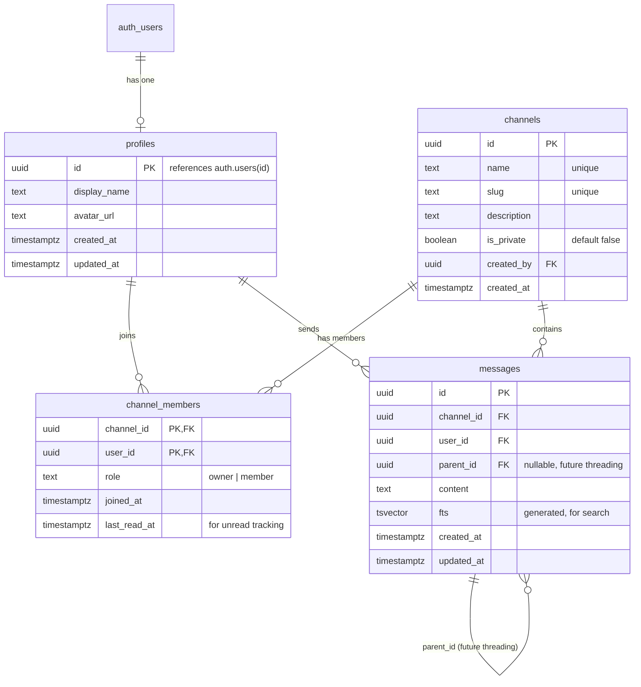

# feat: Build Magic Brooms MVP

## Overview

Build a real-time team chat application for an educational course on AI-assisted development. The app supports authentication (email + GitHub OAuth), public and private channels, real-time messaging via Supabase Broadcast, presence tracking, and full-text search — all powered by Supabase with no custom backend server.

## Problem Statement / Motivation

Students need a functional chat app to learn with. It must be real enough to actually use in a classroom (real-time messaging, presence, channels) while being clean enough to serve as a teaching artifact. (see origin: docs/brainstorms/2026-03-23-magic-broom-chat-mvp-requirements.md)

## Proposed Solution

A React SPA talking directly to Supabase. Schema-first development: design the full database (tables, RLS, triggers, indexes) via Supabase MCP before writing any frontend code. Eight implementation phases from scaffolding through deployment.

## Technical Stack

| Layer | Choice | Notes |
|-------|--------|-------|
| Language | TypeScript | Strict mode |
| UI | React 19 | |
| Build | Vite 8 | |
| CSS | Tailwind CSS v4 | `@tailwindcss/vite` plugin |
| Components | shadcn/ui | Warm palette, friendly type |
| Icons | Lucide React | Via shadcn |
| Backend | Supabase | Auth + DB + Realtime + Storage |
| Router | React Router v7 | |
| State | React Context + hooks | No external state library |
| Testing | Vitest + Testing Library | |
| Deployment | Vercel | Static SPA |

## Project Structure

```
compound/
├── index.html
├── package.json
├── tsconfig.json
├── vite.config.ts
├── components.json              # shadcn/ui config
├── .env.local                   # VITE_SUPABASE_URL, VITE_SUPABASE_ANON_KEY (gitignored)
├── supabase/
│   └── migrations/
│       ├── 00001_create_profiles.sql
│       ├── 00002_create_channels.sql
│       ├── 00003_create_messages.sql
│       ├── 00004_rls_policies.sql
│       ├── 00005_broadcast_trigger.sql
│       ├── 00006_search_index.sql
│       └── 00007_seed_general_channel.sql
├── src/
│   ├── main.tsx
│   ├── App.tsx
│   ├── index.css                # Tailwind entry + warm theme tokens
│   ├── components/
│   │   ├── ui/                  # shadcn/ui (auto-generated, don't edit)
│   │   ├── auth/
│   │   │   ├── LoginForm.tsx
│   │   │   ├── SignUpForm.tsx
│   │   │   └── AuthCallback.tsx
│   │   ├── channels/
│   │   │   ├── ChannelSidebar.tsx
│   │   │   ├── ChannelBrowser.tsx
│   │   │   ├── CreateChannelDialog.tsx
│   │   │   └── InviteMemberDialog.tsx
│   │   ├── messages/
│   │   │   ├── MessageList.tsx
│   │   │   ├── MessageItem.tsx
│   │   │   ├── MessageInput.tsx
│   │   │   └── TypingIndicator.tsx
│   │   ├── presence/
│   │   │   └── OnlineUsers.tsx
│   │   ├── search/
│   │   │   ├── SearchBar.tsx
│   │   │   └── SearchResults.tsx
│   │   └── layout/
│   │       ├── AppShell.tsx
│   │       └── AuthGuard.tsx
│   ├── hooks/
│   │   ├── useAuth.ts
│   │   ├── useChannels.ts
│   │   ├── useMessages.ts
│   │   ├── usePresence.ts
│   │   ├── useSearch.ts
│   │   └── useTyping.ts
│   ├── lib/
│   │   ├── supabase.ts          # Client singleton
│   │   ├── types.ts             # Generated DB types
│   │   └── utils.ts             # cn() utility
│   └── contexts/
│       └── AuthContext.tsx
└── docs/
    ├── ideation/
    ├── brainstorms/
    └── plans/
```

## Database Schema

### Entity Relationship



### Key Schema Details

- **profiles** — Auto-created via trigger on `auth.users` insert. Stores `display_name` (from user_metadata or email prefix) and `avatar_url` (from GitHub OAuth metadata, or null for email users → UI generates initials avatar).
- **channels** — `is_private` flag controls RLS visibility. `slug` is URL-friendly.
- **channel_members** — Composite PK on `(channel_id, user_id)`. `role` is `'owner'` (creator) or `'member'`. `last_read_at` tracks unread state per user per channel.
- **messages** — `parent_id` nullable FK to self for future threading. `fts` is a generated `tsvector` column for full-text search. `updated_at` supports edit tracking.

### RLS Policy Summary

| Table | SELECT | INSERT | UPDATE | DELETE |
|-------|--------|--------|--------|--------|
| profiles | Own profile or any profile (for display names) | Auto via trigger | Own profile only | — |
| channels | Public channels + private channels user is member of | Authenticated | Owner only | Owner only |
| channel_members | Members of channels user can see | Channel owner (invite) or self (join public) | Own membership only | Own membership or channel owner |
| messages | Messages in accessible channels | Own messages in joined channels | Own messages only | Own messages only |

### Realtime Authorization (realtime.messages)

RLS policies on `realtime.messages` parse the channel topic (`room:<channel_id>:messages`) to verify membership:
- **SELECT** — User is member of the channel, or channel is public
- **INSERT** — User is member of the channel, or channel is public

### Broadcast Trigger

```sql
-- Trigger function: broadcasts message changes to the correct room channel
CREATE OR REPLACE FUNCTION broadcast_message_changes()
RETURNS TRIGGER AS $$
BEGIN
  PERFORM realtime.broadcast_changes(
    'room:' || NEW.channel_id::text || ':messages',
    TG_OP, TG_OP, TG_TABLE_NAME, TG_TABLE_SCHEMA, NEW, OLD
  );
  RETURN NULL;
END;
$$ LANGUAGE plpgsql SECURITY DEFINER;

CREATE TRIGGER messages_broadcast
  AFTER INSERT OR UPDATE OR DELETE ON messages
  FOR EACH ROW EXECUTE FUNCTION broadcast_message_changes();
```

### Search Function

```sql
CREATE OR REPLACE FUNCTION search_messages(search_query text)
RETURNS TABLE(id uuid, channel_id uuid, user_id uuid, content text, created_at timestamptz, rank real)
AS $$
  SELECT m.id, m.channel_id, m.user_id, m.content, m.created_at,
         ts_rank(m.fts, websearch_to_tsquery('english', search_query)) AS rank
  FROM messages m
  WHERE m.fts @@ websearch_to_tsquery('english', search_query)
  ORDER BY rank DESC LIMIT 50;
$$ LANGUAGE sql SECURITY INVOKER;  -- INVOKER so RLS applies
```

## Implementation Phases

### Phase 1: Project Scaffolding

Scaffold the Vite + React + TypeScript project with Tailwind and shadcn/ui.

- [ ] `npm create vite@latest . -- --template react-ts` in compound/
- [ ] Install dependencies: `@supabase/supabase-js`, `react-router`, `@tailwindcss/vite`
- [ ] Configure Tailwind v4 via Vite plugin + CSS entry point with warm theme tokens
- [ ] Initialize shadcn/ui with `components.json` (warm palette)
- [ ] Set up path aliases (`@/` → `src/`) in tsconfig + vite config
- [ ] Create `.env.local` with Supabase URL and anon key
- [ ] Create `src/lib/supabase.ts` — client singleton with PKCE auth flow
- [ ] Create `src/lib/utils.ts` — `cn()` utility for shadcn
- [ ] Verify dev server runs with a hello world

**Deliverable:** Running dev server at localhost:5173 with Tailwind + shadcn working.

### Phase 2: Database Schema + RLS (via Supabase MCP)

Design and deploy the full schema before writing any UI. Use Supabase MCP tools.

- [ ] Create `profiles` table + auto-create trigger on auth.users
- [ ] Create `channels` table with `is_private`, `slug`, `created_by`
- [ ] Create `channel_members` table with composite PK, `role`, `last_read_at`
- [ ] Create `messages` table with `parent_id`, `fts` tsvector column, indexes
- [ ] Write RLS policies for all four tables (see policy summary above)
- [ ] Write RLS policies on `realtime.messages` for Broadcast authorization
- [ ] Create `broadcast_message_changes()` trigger function
- [ ] Create `search_messages()` RPC function
- [ ] Seed #general channel (public, no creator)
- [ ] Generate TypeScript types: `npx supabase gen types typescript`
- [ ] Save migration files to `supabase/migrations/`

**Deliverable:** Full schema deployed to Supabase with RLS enforced. TypeScript types generated.

### Phase 3: Authentication (R1–R4)

- [ ] Create `AuthContext` with session state and `onAuthStateChange` listener
- [ ] Create `AuthGuard` component that redirects unauthenticated users
- [ ] Build `LoginForm` — email/password + GitHub OAuth button (shadcn form components)
- [ ] Build `SignUpForm` — email/password with display name field
- [ ] Create `/auth/callback` route for OAuth redirect handling
- [ ] Add logout button in app header
- [ ] Auto-join new users to #general via a trigger or on first channel load
- [ ] Create `useAuth` hook exposing user, session, signIn, signUp, signOut

**Deliverable:** Users can sign up, log in (email or GitHub), and see a logged-in shell. New users auto-join #general.

### Phase 4: Channels (R5–R9)

- [ ] Build `AppShell` layout — sidebar + main content area
- [ ] Build `ChannelSidebar` — list of joined channels with unread dot indicators
- [ ] Build `ChannelBrowser` — browse/join public channels (dialog or page)
- [ ] Build `CreateChannelDialog` — name, description, public/private toggle
- [ ] Build `InviteMemberDialog` — search users by name, add to private channel (owner only)
- [ ] Create `useChannels` hook — fetch joined channels, join/leave, create, invite
- [ ] Implement unread tracking — update `last_read_at` on channel focus, compare with latest message timestamp for unread indicator
- [ ] Route: `/channels/:channelSlug` → loads channel messages

**Deliverable:** Sidebar navigation, channel creation (public + private), browsing, joining, and unread indicators.

### Phase 5: Messaging (R10–R14)

- [ ] Build `MessageList` — scrollable, loads last 50 messages on mount, infinite scroll up for history
- [ ] Build `MessageItem` — sender avatar (or initials), display name, timestamp, content, edit/delete for own messages
- [ ] Build `MessageInput` — text input with send button (Enter to send, Shift+Enter for newline)
- [ ] Create `useMessages` hook:
  - Fetch initial messages (last 50, ordered by `created_at`)
  - Subscribe to Broadcast channel `room:<channel_id>:messages` for INSERT/UPDATE/DELETE events
  - Optimistic send: generate local UUID, render immediately, reconcile on broadcast confirmation
  - Inline retry on failure (not a toast)
  - Edit and delete own messages
- [ ] Handle channel switching — unsubscribe from previous channel, subscribe to new one
- [ ] Auto-scroll to bottom on new messages (unless user has scrolled up)

**Deliverable:** Real-time messaging with optimistic sends, edit/delete, and pagination.

### Phase 6: Presence (R15–R16)

- [ ] Create single global Supabase Presence channel (`online-users`)
- [ ] Create `usePresence` hook — track own presence on subscribe, listen for join/leave/sync
- [ ] Show online/offline dots next to usernames in sidebar or member list
- [ ] Create `useTyping` hook — send typing events via Broadcast (not Presence) on the room channel, debounced
- [ ] Build `TypingIndicator` — shows "X is typing..." below message input, clears after 2s timeout

**Deliverable:** Online/offline status visible for all users. Typing indicators per channel.

### Phase 7: Search (R17–R18)

- [ ] Build `SearchBar` — input in header or sidebar, triggers search on Enter or debounced input
- [ ] Build `SearchResults` — list of matching messages with sender, channel name, timestamp
- [ ] Create `useSearch` hook — calls `search_messages` RPC, returns ranked results
- [ ] Click on a search result navigates to that channel and scrolls to the message
- [ ] RLS ensures results only include messages from joined channels (SECURITY INVOKER on function)

**Deliverable:** Working search across all joined channels with navigation to results.

### Phase 8: Visual Polish + Deploy

- [ ] Apply warm + inviting theme — earthy color palette, friendly typography, comfortable spacing
- [ ] Ensure responsive layout works on tablet/desktop (no mobile-specific work)
- [ ] Add loading states, empty states, and error boundaries
- [ ] Deploy to Vercel as static SPA
- [ ] Configure Vercel rewrites for client-side routing (`/* → /index.html`)
- [ ] Set environment variables in Vercel dashboard
- [ ] Smoke test: sign up → land in #general → send message → see it in real time

**Deliverable:** Deployed, functional chat app at a Vercel URL.

## Technical Considerations

### Realtime Architecture

- **Messaging:** Broadcast + DB trigger via `realtime.broadcast_changes()`. NOT `postgres_changes` (single-threaded RLS bottleneck per Supabase docs).
- **Presence:** Single global Realtime Presence channel. Supabase warns to "use minimally due to computational overhead."
- **Typing:** Broadcast events on the room channel (fire-and-forget, no state tracking overhead).
- **Channel naming convention:** `room:<channel_id>:messages` — parsed by RLS policies via `SPLIT_PART(realtime.topic(), ':', 2)`.

### Auth Flow

- PKCE flow for SPA security (`flowType: 'pkce'`)
- OAuth callback URL: `https://<project>.supabase.co/auth/v1/callback`
- Client redirect: `http://localhost:5173/auth/callback` (dev) or production URL

### Data Boundaries

- No direct Supabase calls in React components — always through hooks
- Hooks handle snake_case (DB) → camelCase (JS) transformation
- One hook per domain concern

## Acceptance Criteria

### Functional (from origin requirements R1–R21)

- [ ] R1: Email + password sign up and login works
- [ ] R2: GitHub OAuth sign up and login works
- [ ] R3: Auth guard redirects unauthenticated users; logged-in users see app
- [ ] R4: Logout works and clears session
- [ ] R5: Public channel creation works
- [ ] R6: Private channel creation works, visible only to members
- [ ] R7: Public channel browsing and joining works
- [ ] R8: New users auto-join #general
- [ ] R9: Sidebar shows joined channels with unread indicators
- [ ] R10: Messages can be sent in joined channels
- [ ] R11: Messages appear in real time for all channel members
- [ ] R12: Messages load on channel open
- [ ] R13: Messages show sender name, avatar, timestamp
- [ ] R14: Optimistic send with inline retry on failure
- [ ] R15: Online/offline status visible
- [ ] R16: Typing indicators work
- [ ] R17: Search returns messages from joined channels
- [ ] R18: Search results show message, sender, channel, timestamp
- [ ] R19: Messages table has nullable parent_id
- [ ] R20: channel_members join table with role and joined_at
- [ ] R21: All authorization via RLS (private channels invisible to non-members at DB level)

### Additional (from SpecFlow analysis)

- [ ] Message edit/delete for own messages
- [ ] Message pagination (last 50, scroll for more)
- [ ] #general channel exists via seed migration
- [ ] Initials avatar for email-signup users

### Success Criteria (from origin)

- [ ] Sign up → #general → send message → see it in real time, under 60 seconds
- [ ] Two users see each other's messages and presence without refresh
- [ ] Search returns relevant results from joined channels
- [ ] Private channels invisible to non-members (DB-enforced)

## Dependencies & Risks

- **Supabase project must exist** with MCP tools configured (confirmed available)
- **GitHub OAuth app** must be registered and configured in Supabase dashboard
- **Broadcast trigger pattern** — `realtime.broadcast_changes()` is newer API; verify it works as documented during Phase 2
- **RLS on realtime.messages** — `realtime.topic()` function must be available; test during Phase 2

## Sources & References

### Origin

- **Origin document:** [docs/brainstorms/2026-03-23-magic-broom-chat-mvp-requirements.md](../brainstorms/2026-03-23-magic-broom-chat-mvp-requirements.md) — Key decisions carried forward: Supabase-first zero backend, Broadcast + DB triggers for messaging, RLS-first authorization, Postgres FTS for search, warm + inviting visual tone.
- **Ideation document:** [docs/ideation/2026-03-23-magic-broom-chat-ideation.md](../ideation/2026-03-23-magic-broom-chat-ideation.md)

### External References

- Supabase Realtime Broadcast: https://supabase.com/docs/guides/realtime/broadcast
- Supabase Realtime Presence: https://supabase.com/docs/guides/realtime/presence
- Supabase Auth: https://supabase.com/docs/guides/auth
- Supabase Full-Text Search: https://supabase.com/docs/guides/database/full-text-search
- Supabase Realtime Authorization: https://supabase.com/docs/guides/realtime/authorization
